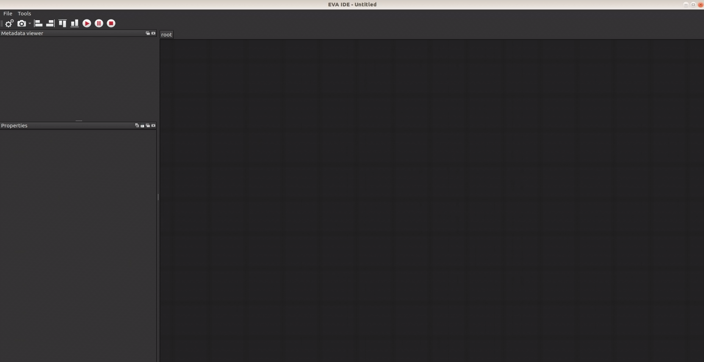
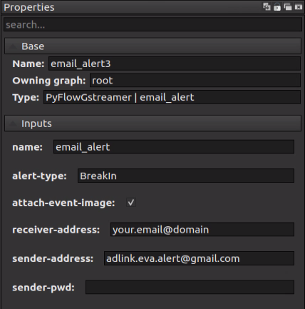

# Showcase 1: Geofencing

## Showcase Requirements

Before installing this showcase to the device, please install ADLINK EVASDK and set the EVA environment as necessary.

## Showcase 1 Installation

The path to the respective demo folder includes install.sh and run.sh for each showcase.

Install.sh will perform the following steps:

1. Build the required plug-ins for each showcase and install them into ADLINK EVASDK.
2. Download the inference intermediate model file and convert it to TensorRT format on the local device.
3. Download the required showcase demo videos and plug-in setup files.

### For this showcase: 

Use the path:

```
> cd src/demo/geofence
```

Run install.sh with root privileges:

```
> ./install.sh
```

This is required to modify the path to the OpenCV library. If you have installed EVA on a non-ADLINK device, please check the requirements in our EVA portal.

<a id="runsh"></a>

After installation, execute run.sh for the pipeline command:

```
> ./run.sh
```

Or you can open EVA_IDE and load pygraph then execute, please see the section, [Run This Showcase Through EVA IDE](#Run-This-Showcase-Through-EVA-IDE).

Then you will see the pop-up display window of this showcase as in the example below.


The red area denotes the restrict area which defined in alert-def-area-geo.txt depends on the video. This file provides the defined area with normalized clockwise coordinates x and y each row. Once you modified this geofence plugin source code, required to rebuild it simply direct to the path [/src/plugins/geofence](/src/plugins/geofence) and run geofence-build.sh for ubuntu system or geofence-build.bat for windows 10. (windows version of this showcase will provide in later version) The email alert plugin were implemented in python. Once modified the email alert plugin, direct to [src/plugins/alert/email](src/plugins/alert/email) and run email-build.sh for ubuntu or email-build.bat for windows 10. (windows version of this showcase will provide in later version). The same rebuild procedure for other alert plugins. More detail setting could be found in EVA Portal.

*Modified installation details can be found at the EVA Portal: < Under Construction >

## Training Materials

The training materials can be downloaded with the following links.

Training images: https://adlinkdxstorage.blob.core.windows.net/file/geo-fencing-training-images.zip

Training notation for mobilenetSSDv2: https://adlinkdxstorage.blob.core.windows.net/file/geo-fencing-mobilenetSSDv2.zip

Training notation for yolov3: https://adlinkdxstorage.blob.core.windows.net/file/geo-fencing-yolov3.zip

Training architecture site list below: 

mobilenetSSDv2: https://github.com/tensorflow/models/blob/master/research/object_detection/g3doc/tf1_detection_zoo.md, ssd_mobilenet_v2_coco

yolov3: https://github.com/AlexeyAB/darknet/tree/Yolo_v3

Note: Showcases 1 and 2 use the same training materials.


## Run This Showcase Through EVA IDE

In this showcase, you can run the pipeline by execute <a href="#runsh">run.sh</a> but also EVA IDE. Open EVA IDE and make sure your current path is in src/demo/geofence as root:

```
> EVA_ROOT/bin/EVA_IDE
```

EVA_ROOT is the path where the EVA is installed, the default installed path is /opt/adlink/eva/. So directly call EVA_IDE:

```
> /opt/adlink/eva/bin/EVA_IDE
```

And you will see the IDE show up as below:



Then select showcase1.pygraph in this showcase folder through File->Load. Then you can see this showcase pipeline:


The settings are default set relevant to this scenario and one alert require to be set. Click on the email_alert node in the pipeline and the property window will show the node properties detail at left side. See the figure below:

 

Provide an email address you want to receive from the alert for this show case in "receiver-address". Then press the play button  and you will see the scenario video start to play.

